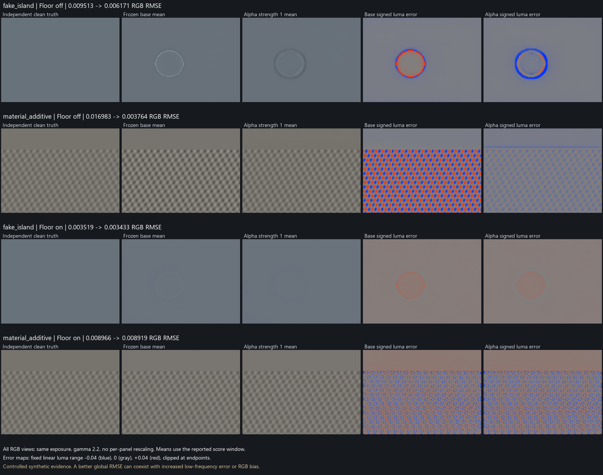

# Experimental Alpha: additive light sharing

September 29, 2026. Branch: `ffxD-experimental-alpha`.
Baseline: `ffx-denoise-experimental`, `56e1af15ee9fd6d57daac12e240159eac1c3df8e`.
The baseline's remote branch tip was verified at the start of implementation.
A separate Git worktree was used, preserving the Stage workspace.

## Hypothesis and scope

Source idea: Zakrisson-C's
[`b151554d`](https://github.com/Zakrisson-C/OptiScaler/commit/b151554de7cafd17e886a5d61e9983dc78e7cffc)
additive light split experiment. The neighborhood estimate `C ≈ a*(Ad+As)+b`
aims to reduce the division of an albedo-independent contribution by diffuse
texture. `b` is not a measurement of physical fog or the actual specular lobe.
The inputs are only combined color and guides; the solution relies on specific
local assumptions.

The first alpha package estimates the split spatially within the existing
conversion; it adds no sharing history or new color history. The existing RR
history continues to operate. SSS, JointField, and Stage 8 recovery algorithms
are outside this package's scope. Source albedo, RR guides, and
demodulation/remodulation coefficients are unchanged. The new control is off
by default; baseline compatibility at zero is measured separately.

## Implementation contract

`[FSR-RR] AdditiveLightSplit=auto` means the default value of `0`. In the menu,
**Input Compatibility → Additive Light Split (Experimental)** ranges from 0–1.
Non-finite INI values revert to off. Changing the control invalidates the
existing denoiser and recovery history.

The estimate requires at least 12 valid samples from the same surface in a
7×7 neighborhood. Depth, normal, and roughness boundaries are respected;
each source uses its own subrect origin. Samples outside the edges are skipped,
not duplicated. Per-channel ridge regression uses the stored UNORM albedo
weights. With Floor enabled, the signal is that pixel's
`max(raw-spatialFloor,0)` residual; special handover, emissive, bias, and
responsivity bypass paths are excluded from the estimate.

Albedo variation and a positive intercept require local statistical support.
Specular albedo must be at least `4/255`, and its neighborhood variation must
be no more than 10% of its mean; the specular divisor cannot fall below the
existing divisor floor. The new share is also checked for FP16 overflow.
These are conservative conditions that reject ambiguous or harmful routing,
not proof of physical separation.

For accepted channels, diffuse is obtained by subtracting specular from the
total. Partial Floor bypass uses the same share. Actual divisor/overflow
losses remain in the existing Skip accounting; new positive FP16 rounding
residuals are not added as raw noise. Rejected channels retain the old
calculation. RR guide RGB, roughness, motion, ray distance, and the composition
shader are unchanged. The existing diagnostic in specular guide alpha
continues to show the actual signal share.

There is no new full-resolution buffer, dispatch, or history. The conversion
CB's last four padding bytes are used; its size remains 416 bytes. In the
enabled variant, each 8×8 pixel group stores 14×14 neighborhood data in
group-shared memory. This avoids repeating expensive source/surface checks
for every neighboring pixel. If the group's valid total albedo is completely
constant, the variance condition cannot pass; the additional signal and
handover scan is skipped. The window, sample order, eligibility conditions,
and estimation thresholds are preserved. Zero additional full-resolution
buffers does not mean zero GPU cost; measurements are given separately below.

### Preserving the disabled path with a separate shader

The first implementation used a strength=0 branch in a single shader. A
difference seen only in diagnostic alpha in a simple example also appeared
in signal RGB and Skip values with more complex guides. An independent
random RGB example reproduced the same difference. Preserving the old
calculation in the source's disabled branch did not guarantee that the
compiler would produce the same GPU arithmetic.

The disabled setting therefore selects the original conversion shader. A
positive setting uses a separately compiled variant of the same source that
includes the additive estimate. The root signature, resources, and dispatch
count are shared; there is only one additional PSO. The lossless test compares
all channels exactly, including diagnostics; no tolerance exception is added.

A separate pre-existing bug in the comparison tool was also fixed: the
modulation/recovery defaults previously omitted for the frozen shader are
now supplied with the same effective values as for the current shader.
This prevents even the unchanged composition shader from being compared
with different parameters.

## Lessons from the Joint experiments carried into acceptance conditions

- The identity round-trip test and the actual AMD image test are separate gates.
- Real material texture and a fake albedo island are evaluated together.
- A filtering difference caused by roughness/normal is not the same defect
  as a modulation imprint.
- Input sharing can affect both lobe outputs together; a final-weight test
  does not replace this test.
- Moving a contribution into Skip because of small specular albedo does not
  count as a blotch fix.
- Real wave/lighting contrast and noise are reported together.
- The clean target of a single static capture is unknown; image changes in
  that capture are not scored as error reduction. A synthetic island with a
  known clean target is the primary counterexample.

## Experiment protocol

Production conversion DXIL → actual AMD RR → production composition DXIL.
The baseline shaders were frozen under `tools_tmp/alpha_baseline/precompile`
before the change; source commit and file hashes will be retained in the
experiment record. Compatibility of the disabled candidate with the baseline
is not checked only against that same candidate's zero output. The independent
clean target is not supplied to the production estimator.

Development uses strength 0 and 1 endpoints, with 0.5 as an intermediate value
if needed. Parameters are not tuned specifically for individual scenes.
Frame counts and warm-up are equal, with the same seed and tuning. Motion and
reset checks are reported separately from the static island result. No other
GPU tests run concurrently during timing measurements.

To consider a setting the preferred candidate, it must provide measurable
improvement in the additive lighting/textured material scene, with no
meaningful regression in fake island, real detail, and noise checks. The
relative 5% regression limit will be evaluated together with an absolute error
floor; near-zero baseline error will not be exaggerated through percentages.
This overall quality selection does not replace low-level finite-value,
energy, and guide-invariance tests. A candidate that fails will not become
the default.

## Measured quality result

**This candidate was not accepted as a general blotch fix; it remains off by default.**
There is a strong improvement in the synthetic example where additive
lighting and real albedo texture are mixed. However, the broad color deviation
around the fake island, the color bias of moving texture, and the first frames
of the lighting transition did not pass all acceptance conditions. No
meaningful correction was seen with the recorded island's guides.

The same SDK DLL, the same tuning, and independent contexts were used on an
AMD Radeon RX 9070: 42 independent contexts, totaling 2,688 AMD frames. Each
sequence has 64 frames; the last 16 were scored. The main matrix is 8 scenes ×
strength 0/0.5/1; additional matrices cover an independent seed, Floor enabled,
motion/lighting transitions, and recorded guides. Model tuning: disocclusion
0.1, normal strength 0.5, stability 0.5, max radiance 40000, radiance clipping
K 40, Gaussian relaxation 0.5. Composition recovery is disabled in these
causal quality comparisons.

### Real texture and additive lighting

Floor disabled, strength 1: RGB RMSE on the main seed was
`0.016983 → 0.003764` (a 77.8% reduction). This was reproduced with the
independent `91743` seed at `0.017027 → 0.003774`. Contrast gain was
`1.610 → 1.099`; since the clean target is 1, excessive contrast is reduced.
However, mean RGB bias and target error in quiet regions can worsen. An
improvement in the main metric does not mean the whole image is accepted.

### Synthetic fake island

On the independent seed, RGB RMSE decreased from `0.009467 → 0.006241`, while
the low-frequency error measure went from `0.004040 → 0.005008` (a 24%
increase). Visually, the thin bright ring becomes a broader dark ring. The
RGB bias limit also failed. The local estimate operating mainly at the
high-contrast boundary and the model's joint response to the two inputs are
possible explanations to investigate; they were not individually proven
root causes in this experiment.



### Floor, motion, and the recorded island

- With Floor enabled, additive material RMSE was `0.008966 → 0.008919`: a
  small change that does not pass the predefined minimum improvement
  condition. In this example, about 89.7% of the energy is in the existing
  Floor/Skip path; the candidate did not increase this share. Floor's existing
  spatial processing may not produce exact identity with the noisy raw image;
  an identity difference against the probe's raw input alone is not a new
  accounting error. Numerical closure was also tested with controlled native
  examples.
- On the moving plane, RMSE was `0.016930 → 0.004254`, but RGB bias increased.
  This wrapping moving-plane experiment is not general acceptance for
  disocclusion/ghosting.
- In the first frame after the lighting intensity step, RMSE increased from
  `0.09403 → 0.10391`; in the final scoring window it decreased from
  `0.03329 → 0.02194`. Looking only at mature history would have hidden the
  regression during the early transition.
- Two independent clean signals were constructed using actual source albedo,
  source normal/packed roughness, ray distance, and camera from the recorded
  island: flat color and a wave. Flat-color RMSE was `0.010933 → 0.010918`;
  wave RMSE was `0.010996 → 0.011009`. Wave contrast remained at
  `0.5656 → 0.5637`. These do not show meaningful blotch/detail correction.
  The game's recorded RGB was not used as the clean target. In the
  first/last-frame conversion audit, strength 0 and 1 outputs of the same
  experimental shader were completely identical in the island's scored
  region: there was no observable sharing change in that region in those
  frames. The fitted-channel mask was not measured for all 64 frames. Small
  arithmetic differences between the original and experimental shaders, and
  the possibility of real sharing changes outside the region propagating
  through RR, complicate interpretation of the small quality change.
  Therefore, these numbers are not evidence for the quality of additive
  sharing within the island.

The recorded-guide experiment does not rerun the JointUniform path; it
passes the same actual guides through alpha's baseline conversion. It would
therefore be incorrect to turn these numbers directly into improvement
ratios against the old JointUniform experiment. The guarded candidate's lack
of effect also does not prove that all possible additive separations are
ineffective.

### Acceptance criterion record

The first frozen check limited the decrease in contrast gain relative to the
baseline. When the baseline raises contrast excessively, this criterion can
decide in the wrong direction. The first report was not changed. Before
running the new `91743` seed, the `|gain-1|` distance from the target and local
low-frequency/RGB bias conditions were explicitly defined. This second
criterion also rejected RGB bias in the fake island and material. A zero
exit code from the probe means the experiment completed; it does not mean
quality acceptance.

## Technical validation and cost

Final targeted native set: 64/64 checks, 75 production shader dispatches.
Boundary/Floor/HDR examples where the estimate was separately proven active;
small, missing, colored, and textured specular; source origins; masks and
invalid inputs; and setting/reset integration were tested. A separate check
verified that quantization noise in an accepted new share is not moved into
Skip. Numerical HDR tests do not claim AMD quality acceptance at all HDR
levels.

The pre-optimization candidate is tracked as `398dd3bc…`, and the final
candidate as `64332e35…`. In the final broad comparison, 2,085/2,085
enabled-variant comparisons were bit-for-bit identical across all channels;
4,962 production dispatches ran in total. Coverage included all 64 frames
of the main scenes, independent seed, motion/lighting transitions, Floor,
and recorded island guides; edges, partial groups, and source origins were
also covered. In addition, 84/84 constant-albedo checks produced no false
estimate. The AMD measurements above are therefore retained from the first
candidate; optimization is not presented as a new quality result. D3D12
debug layer error/warning counts are zero. The original disabled shader
`1eb2b8fb…` is unchanged. Group memory is 11,768 bytes; an independent review
checked partial groups, bounds, and the four group barriers.

Isolated cost was measured on the RX 9070 at 1280×720 with three trials in
varying order. The first 10 of 40 dispatches in each trial were discarded
for warm-up. This measures conversion GPU time only; AMD RR, Floor's other
passes, CPU upload, and the game's full frame time are excluded.
Baseline → strength 1 medians:

- Flat albedo, Floor disabled: `0.142 → 0.669 ms`.
- Flat albedo, Floor enabled: `0.974 → 1.657 ms`.
- Textured albedo, Floor disabled: `0.151 → 1.998 ms`.
- Textured albedo, Floor enabled: `0.351 → 2.577 ms`.

The first uncached prototype spent approximately `4.98–21.30 ms` on the same
four examples. The final candidate is substantially cheaper, but still has
significant additional cost when enabled. The disabled variant uses the
original bytecode; small timing differences are not interpreted as a separate
algorithm cost beyond GPU clock/measurement variability. These measurements
are not extrapolated to 1080p/4K or game FPS.

The final release gate passed a zero-tolerance comparison against the original
baseline: 3,221 checks, 4,623 production dispatches, and a successful Release
x64 build. The DLL was checked to contain all five validated shader
bytecodes. Historical A/B packages were unavailable for five test groups, so
the corresponding comparisons were skipped; skips were not counted as
passes. Names and details are recorded in the validation JSON. No in-game
acceptance or deployment was performed.

Implementation commit: `3b245f40`. The final Release DLL was rebuilt with
this commit identity; embedding of all five shaders was checked again.
The final DLL identity is in the `commit_stamped_build` record; the earlier
test build was archived separately. The build carries the baseline's
C4744/LNK4098 warnings.

## Rerunning

Run from the repository root with Python containing NumPy/Pillow, MSVC,
Windows SDK/DXC, and the D3D12 debug layer. The first command extracts the
original baseline snapshot from Git and verifies source/bytecode identity.
The actual AMD probe requires the FidelityFX SDK v2 submodule and its signed
denoiser DLL.

```powershell
python OptiScaler/shaders/shader_tools/tests/test_fsrd_additive_split.py
python OptiScaler/shaders/shader_tools/validate_fsrd.py --build --lossless-baseline tools_tmp/fsrd_alpha_native/frozen_base --output tools_tmp/alpha_recheck
python OptiScaler/shaders/shader_tools/tests/probe_fsrd_additive_split.py --baseline tools_tmp/fsrd_alpha_native/frozen_base --output tools_tmp/alpha_quality_recheck --floor off --strengths .5,1
python OptiScaler/shaders/shader_tools/tests/probe_fsrd_additive_split.py --baseline tools_tmp/fsrd_alpha_native/frozen_base --output tools_tmp/alpha_holdout_recheck --floor off --strengths 1 --scenes fake_island,material_additive,wave_lighting --prospective --seed 91743
python OptiScaler/shaders/shader_tools/tests/benchmark_fsrd_additive_split.py --baseline tools_tmp/fsrd_alpha_native/frozen_base --output tools_tmp/alpha_timing_recheck
```

Run the cost command separately while other GPU jobs and the game are closed.
The recorded island test requires an optional original capture/NPZ; these
are not mandatory dependencies of the repository tests. Numerical summaries
and identities are kept in the [validation record](fsrd_alpha_validation.json),
and raw local outputs in the `tools_tmp` directories identified in the report.
