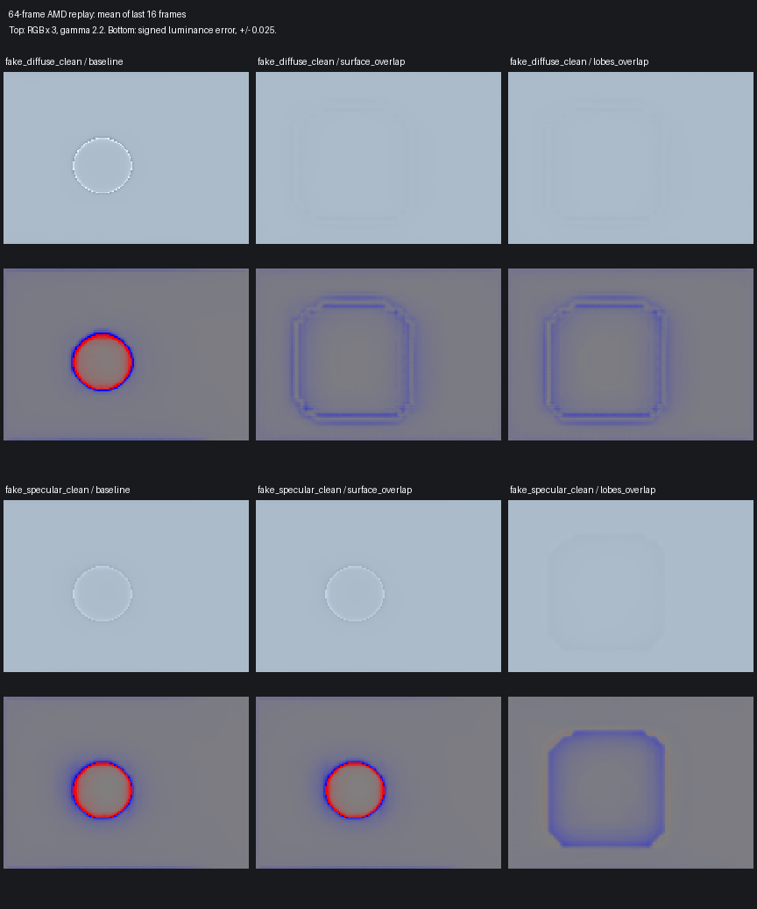
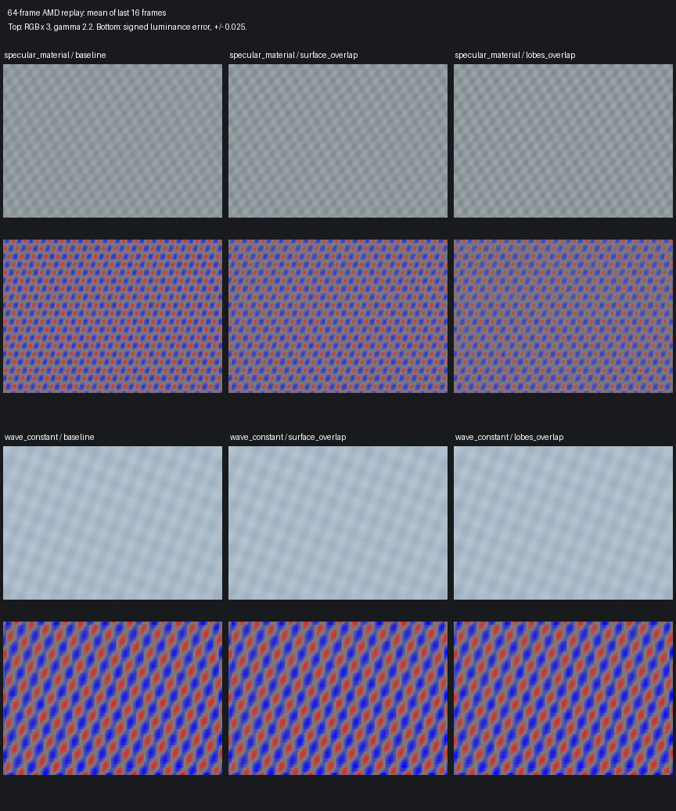

# Additive allocation: channel diagnostics and spatial model research

Follow-up: [paired pre-SR capture and statistical resolve](fsrd_alpha_statistical_resolve.md)
fixes applied-model validation and extends the capture to v2. Measurements below
describe the original `5febc967` study, not the corrected allocator.

This package adds a capture path and controlled research tools. It does not
promote a new allocation algorithm to the game path. The existing additive split
remains disabled by default. A lower RMSE alone is not quality acceptance.

## Live capture

Under **Input Compatibility → Additive channel capture**, select a render-space
ROI and press **Capture additive channels**. The origin is rounded down to a
multiple of eight; the bounded ROI is 64 or 128 pixels per side. Keep rendering
until the status reports a saved folder beside the DLL, under `RRTrace/`.

The capture dispatches the same diagnostic experimental shader at strength zero
and one on the same bound input resources, before normal conversion. It does not
change the user's setting, denoiser history, production output resources, or
normal shader selection. The captured pair is an input-allocation comparison;
it is not a pair of independent AMD histories or an output-quality comparison.
The trace clears menu debug-color replacement flags while preserving conversion
controls; the manifest records both original and effective flag words.

Every field contains independent R, G and B values. Six pages per endpoint record:

- Rejection bits, evaluated bits, eligibility, preflight and final sample counts.
- Albedo/residual moments, specular range, ridge lambda, and the data's fraction
  `variance / (variance + lambda)`. The complementary fraction comes from the
  prior. This fraction is not a probability of correctness.
- Unregularized and prior slopes, ridge slope, unclamped/clamped intercept,
  intercept uncertainty, residual RMSE, applied slope/intercept, center prediction
  and signed center error. The current local estimator's center error is in-sample;
  only the separate spatial research model uses a held-out center block.
  The reader derives the unregularized intercept as
  `mean_residual - unregularized_slope * mean_albedo`; both coefficients before
  regularization can therefore be compared with the ridge solution. Interpret
  those values only when the fit moments were evaluated.
- Original share `p0`, applied share `p`, signed `delta_p`, and residual radiance
  transfer `R * delta_p` before demodulation and partial Floor restoration.
- Eligible radiance, spatial Floor, final Skip, raw radiance, relative energy,
  final specular/diffuse inputs, and modulation settings.
- Source diffuse/specular, normal, roughness, linear depth, source motion and
  stored material guides. Stored guide values explicitly reproduce UNORM8
  quantization despite the journal using FP32 textures.

Fit evidence is evaluated even at strength zero. Eligibility additionally includes
model positivity and FP16 safety for that endpoint, so it is not guaranteed to
match between endpoints. `delta_p` and transferred RGB show what actually
happened. Zero-strength conversion retains the disabled arithmetic. Unvisited
checks are not passes. Source/route validity can reject the entire RGB triplet;
later statistical and specular checks operate per channel. Rejection reasons can
overlap and must not be added as mutually exclusive percentages.

The bit definitions are maintained in
`OptiScaler/shaders/shader_tools/tests/fsrd_additive_diagnostics.py`. The journal's
FP32 estimates are separately instrumented; offline tests also export actual
stored outputs from the production experimental DXIL at both strengths, and
reconcile them with the journal. Comparing the original disabled shader with a
different experimental shader is not used to infer fitted-channel activity.

Inspect a saved live capture from the repository root:

```powershell
python OptiScaler/shaders/shader_tools/tests/inspect_fsrd_additive_capture.py --capture <capture-folder> --output <new-analysis-folder>
```

The reader authenticates all 96 images and the constant buffer, checks dimensions
and computed-field finiteness, and writes a channel NPZ plus a JSON summary.
Invalid source guide values remain available as evidence and are counted rather
than silently cleaned. It reports
energy-weighted RGB fractions as well as pixel fractions. It also reconstructs
stored-domain specular/diffuse transfer and Skip changes using the matching
modulation multipliers. This distinguishes residual-only transfer from changes
after partial Floor restoration. Per-pixel ratios at zero raw energy are not
physical energy fractions; prefer the aggregate energy-weighted measures.

## Capture lifetime and cost

No capture textures, PSO or dispatches are created without a request. Capture
owns its scratch images, readbacks, descriptor heaps, twelve constant-buffer
slots and input resource references. Queue submission is observed before the
real `ExecuteCommandLists` call; a real fence is signaled afterwards on that
queue. Export requires both fence completion and a successful command-list Reset.
Discarded, repeated or failed submissions cannot be exported. Uncertain resources
are retained instead of being recycled based on elapsed frames.

The capture uses twelve bounded dispatches, eight reusable scratch images and
96 readbacks. Raw image storage is approximately 6.5 MiB at 64×64 or 26 MiB at
128×128, before driver/PSO overhead and export buffers. Capture is diagnostic work
and may hitch. These are allocation counts, not measured in-game timing claims.
Normal rendering still incurs a small request/poll check; no zero-CPU-cost claim
is made. The queue/fence test invokes adapters explicitly and does not certify
that every game's wrapped queue is detoured successfully.

## Wider surface support and separate lobe bases

`fsrd_allocation_models.py` implements two research-only CPU estimators. Their
outputs are applied through a separate test shader and then passed through the
real AMD DLL and production composition. No clean target is supplied to either
estimator, no temporal allocation history is added, and no extra user slider is
introduced.

The surface candidate fits `R ≈ a*(Ad+As)+b` using a wider connected neighborhood
around an excluded central 8×8 block. It requires relatively flat, safe specular
albedo. The ring must predict the excluded block; a constant interior with no
identifying contrast is rejected. The original block candidate created visible
block seams. The revised `_overlap` variants use four-pixel strides and separable
tent weights to blend predictions from overlapping eight-pixel supports. Missing
support contributes the original allocation; it does not create a new intercept.
Support weight is coverage, not statistical confidence. These remain bounded
spatial-field feasibility candidates rather than production propagation schemes.

Support is restricted by a local depth-plane residual, normal, roughness and
connected surface mask. A significant lighting-plane explanation competes with
the material fit. The synthetic tests use planar geometry; this screen-space
depth-plane approximation does not establish correct behavior on general
perspective surfaces, reflection layers or disocclusions.

The lobe candidate fits `R ≈ ad*Ad + as*As`. Column scaling, rank, condition number,
fit covariance, held-out error and allocation uncertainty are recorded. Negative
or unreliable contributions are rejected. An identifiable third additive term is
also evaluated. When it materially explains the held-out signal, the estimator
records it and rejects routing: that contribution is not automatically assigned
to specular or passed unfiltered through Skip.

The noiseless tests also exposed tiny negative SVD results for an exactly zero
coefficient. A condition-scaled floating-point roundoff bound is kept separate
from the statistical error bound, preventing arbitrary rejection of identical
constant-color blocks. Meaningfully negative estimates remain rejected.

The joint dispatch uses shared diffuse/specular material guides. A further signal
slot alone does not provide an independently neutral material guide. A separate
context or application filter would require a separate design for motion,
disocclusion, exposure, ownership and cost. This package does not claim to have
implemented that layer. See the [AMD denoising API documentation](https://gpuopen.com/manuals/fsr_sdk/techniques/denoising/).

## Quality protocol

The research matrix includes noise-free fake diffuse and fake specular islands,
correct material texture, constant-albedo waves, a colored lighting gradient,
collinear bases, noisy specular islands, an exposure step, independent lobe bases,
and identifiable additive light on independent bases. Each sequence uses 64
frames, with the final 16 scored separately from the transition's early frames.
Both endpoints use the same test conversion bytecode.

Record RMSE, broad tone error, a signed radial RGB error profile, thresholded ring
width, signed RGB bias, detail gain relative to clean truth, remaining temporal
noise, actual allocation effect and allocation variation over time. A minimum
effect requirement prevents a no-op from being accepted as an effective fix.
Noise-free inputs still test the real temporal model; a lack of input noise does
not imply an identity model. Early exposure frames must pass separately.

```powershell
python OptiScaler/shaders/shader_tools/tests/test_fsrd_additive_diagnostics.py
python OptiScaler/shaders/shader_tools/tests/test_fsrd_additive_lifetime.py
python OptiScaler/shaders/shader_tools/tests/test_fsrd_allocation_models.py
python OptiScaler/shaders/shader_tools/tests/probe_fsrd_allocation_models.py --output <new-directory> --frames 64 --seed 944029 --models surface_overlap,lobes_overlap
```

The probe's successful exit means the experiment completed. Its recorded quality
gates, activity and limitations determine acceptance; they are not implied by
the process exit code. The CPU estimator is a research reference and its elapsed
time must not be presented as the cost of a proposed GPU implementation.

## Island results and promotion decision

The overlapping candidates do not pass the mandatory island quality gates.
At seed 944029, the noise-free fake diffuse island's RMSE falls from 0.0086645
to 0.0022803 with surface support and 0.0023182 with separate lobe bases. Both
still fail signed RGB bias. For the noise-free fake specular island, the
two-lobe candidate lowers RMSE from 0.0043167 to 0.0023079, but fails both broad
tone error and signed RGB bias. These are active changes, not no-op successes.



The fixed-scale error panels expose a wider, lower-amplitude support-shaped band
around the island. Overlap reduces the original block seams; it does not remove
the support-boundary problem. The surface model is inactive on the fake specular
island, as required by its flat-specular assumption. Small output differences
between independent AMD contexts with identical packed inputs are not credited
to allocation. The native same-kernel test verifies exact stored-channel identity
when the research acceptance mask is zero.
The evidence summary also compares hashes of the complete diffuse/specular
signal sequences actually uploaded to AMD. Estimated field activity cannot
substitute for a changed signal sequence; missing byte-level evidence cannot
receive effective-success credit.
Some inactive rows even fail an image nonregression budget despite identical
AMD inputs. Those differences are independent-context control variation, not an
allocation effect. This single-seed matrix supplies conservative rejection and
visible counterexamples, not confidence intervals for every small metric delta.
Future promotion needs repeat-context and independent-seed confirmation as well
as passing the mandatory scene classes.

The lighting-gradient guard is useful but incomplete: some noisy neighborhoods
still accept a material explanation. Passing an output metric on that scene does
not establish physical separation of colored lighting. Constant-guide wave and
collinear-basis cases are separately checked for unsupported allocation.

The initial experiment also computed a radial width gate on non-island scenes.
That statistic has no semantic ring interpretation on arbitrary material texture;
it must not be cited as evidence of an island there. The mandatory island failures
above remain independent of this limitation. The per-frame errors and raw metric
values and original decisions are preserved. The current assessor limits that
gate to `fake_*` fixtures; the evidence summary includes both original decisions
and this corrected applicability. No numerical tolerance has been relaxed.

No candidate is promoted to production. A future candidate must remove the
support-shaped bias while keeping actual activity, detail and early-transition
behavior within their fixed limits. A filter for an independently identified
additive layer still needs its own motion/exposure/lifetime design and quality
tests; an unconstrained fit or unfiltered Skip route is not that design.

The exposure-step surface candidate provides a separate counterexample: mature
RMSE improves from 0.0337512 to 0.0246200, but the first four post-step errors
increase from `[0.09229, 0.08780, 0.08174, 0.07649]` to
`[0.10406, 0.10137, 0.09584, 0.09149]`. It fails the early-transition gate despite
passing the mature-frame budgets. The allocation field has no temporal history;
the downstream denoiser still has history. Conserved input color does not imply
an unchanged temporal output.

The constant-albedo wave has approximately 0.512 detail gain for baseline and
both inactive candidates. This is nonregression, not proof that wave contrast
is preserved absolutely: the underlying denoiser already loses considerable
contrast in this fixture. No-op protection must not be presented as a wave fix.



A separate eight-frame Floor-on integration smoke covers the fake specular
island and additive material. On the former, approximately 99.85% of image energy
is in Skip. The estimate and actual AMD signal bytes change, yet composed RMSE
is identical at 0.0001209. On the latter, the field is inactive. These short
sequences validate accounting/integration, not mature-history image quality.
They illustrate why acceptance, actual transfer, and image-energy coverage must
be reported separately.

All 33 main variants completed: eleven scenes, three variants each and 2,112 AMD
frames. The [compact matrix evidence](evidence/fsrd_alpha_allocation_models.json)
preserves every frame's RMSE, signed/broad-tone/detail/noise metrics, original
decisions, corrected gate applicability, source hashes and actual AMD input
hashes. In the third-term scene, the final-frame two-lobe estimator rejects
100% of red/green and about 99.06% of blue ROI pixels for the identified additive
term. A small blue acceptance residue remains; it is not a reliable separate
layer or a successful fix.

## Recorded island attribution

An authenticated historical JointUniform capture can supply actual source RGB
and guides to `probe_fsrd_captured_allocation.py`. This is a cropped replay through
the current alpha conversion with Floor disabled, not a rerun of JointUniform or
a measurement of the current live game's Floor path. Test uploads normalize
color/guides to RGBA16F; live capture reads the bound game resources directly.
Captured game RGB is not treated as clean truth.

In the historical upper-left island ROI, the local estimator accepted no RGB
channels and transferred no radiance. Approximately 21.17% of the ROI failed the
same-surface sample count. Of the remaining pixels, almost all failed specular
variation; intercept evidence was also insufficient in most tested channels.
These overlapping failures explain why increasing strength cannot activate this
estimator there. They do not prove the visual blotch's physical cause.

The wider surface and two-lobe reference models also accepted no channels in this
ROI. The two-lobe fit primarily required prohibited negative coefficients rather
than failing rank. More unknowns alone did not yield a trustworthy decomposition.
This is a measured limitation, not a reason to relax the sign/conditioning guards.

The final replay verifies all eight stored RGB outputs are identical between
strength zero and one within this ROI. Both block and overlapping research
models are inactive there. In the overlapping two-lobe model, approximately
87% of the ROI is rejected for negative coefficients and 13% for insufficient
surface support (with a small additional blue-channel conditioning rejection).
Within the sign-rejected ROI pixels, all three channels require a negative
diffuse coefficient and a positive specular coefficient. Median `(ad, as)` pairs
are approximately `(-3.37, 1.70)`, `(-3.45, 1.52)`, and `(-4.40, 1.27)` for RGB.
This indicates incompatibility with the two-positive-coefficient neighborhood
model. It does not distinguish invalid guides from changing illumination,
reflections or guide bases that describe different layers.

The [recorded-source evidence](evidence/fsrd_alpha_recorded_island_channels.json)
contains both full-crop and island-ROI summaries, individual RGB reason masks,
actual stored-channel changes and source/shader hashes. The unchanged game RGB
is not a reference rendering, so these data establish allocation inactivity,
not the root cause or perceptual magnitude of the original blotch.

## Validation

The [validation record](evidence/fsrd_alpha_channel_validation.json) records a
passing Release x64 build and release gate: **3,342 GPU checks and 4,679
dispatches**. All six shader artifacts reproduce, and their bytecode is embedded
in the built DLL. The five existing production CSOs are byte-identical to
`f2764954`; only the new capture shader is added.

The channel suite contributes 121 checks across 56 GPU dispatches, including
independent fit attribution, RGB-specific rejection, Floor accounting, exact
same-kernel no-op behavior, UNORM storage reconciliation and partial render-edge
ROIs. D3D12 validation reports zero errors and warnings. Separate final checks
cover ten reader/integrity cases, twenty spatial-model/acceptance cases, eleven
fence-state cases and a native WARP queue-fence/reset smoke.

Historical comparisons requiring absent reference packages remain skipped in
the volume-handover, speckle-anchor, patch-handover, small-colour-screen and
colour-anchor groups. They are not claimed as passes. The live injected game's
queue hooks have not been exercised; native adapter tests and shader dispatches
do not certify that integration. The research candidates fail quality acceptance
and remain outside the game path.
