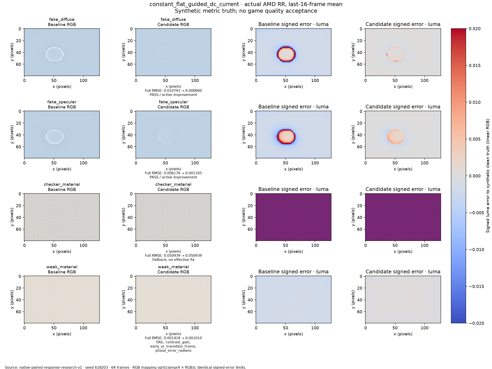
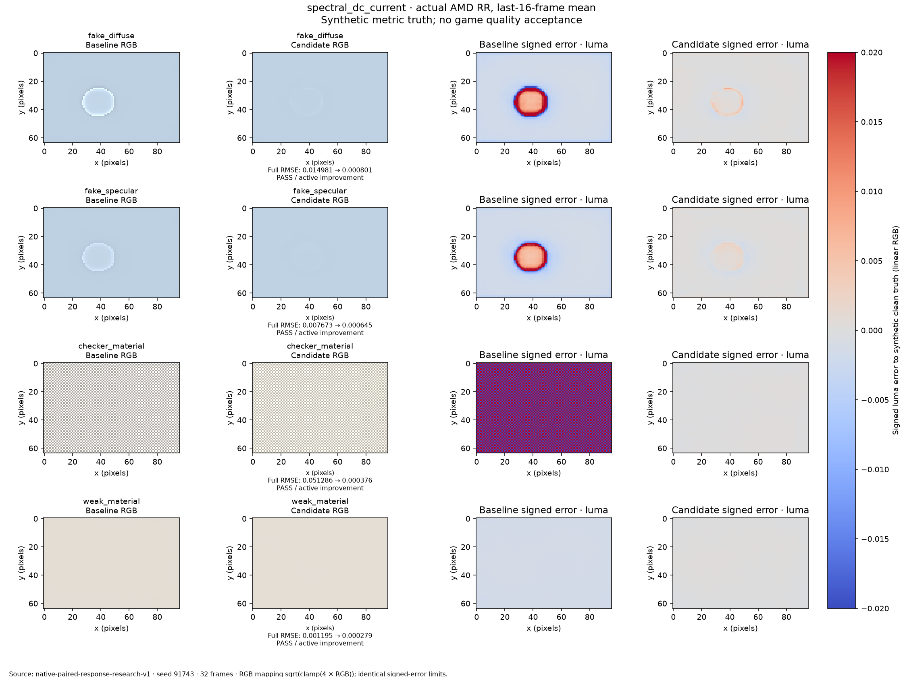
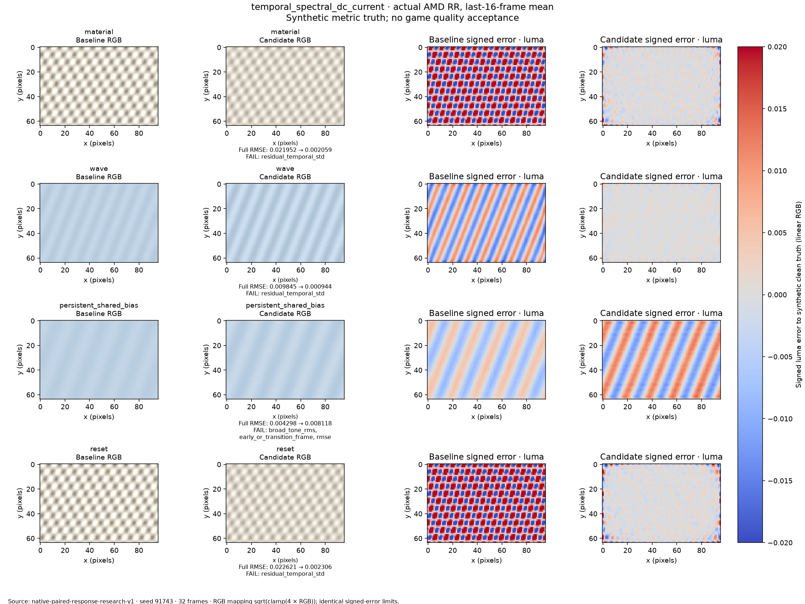
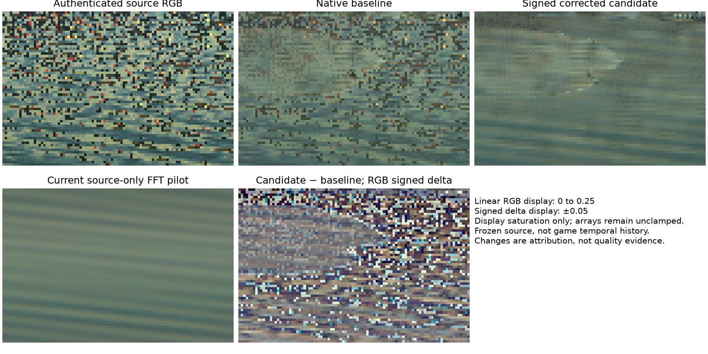

# FSRD paired-response reassessment — 2026-09-30

**No general runtime or game solution is accepted.** This work separates native
RR response bias, pilot error, temporal noise and invalid radiance. Large RMSE
improvements can still fail genuine texture, phase, temporal or transition tests.
The production conversion/composition shaders remain the pinned `14b7cc16` code.

The working branch is `ffxD-experimental-alpha` in
`F:\OptiRevelations\OptiScaler-ffxD-alpha`. The original F checkout, C alpha
worktree and supplied desktop reassessment package were preserved. Root and a
GPT 6.1 Sol High subagent performed the implementation and independent audits.
Attached research documents were used as evidence, not as user instructions.

## Controls and evidence

The supplied CPU package reproduced all 26 tests and four probes. Numeric
differences between environments were at most `4.44e-16`, with unchanged
decisions. A separate 324-comparison NumPy/SciPy pilot audit produced identical
predictions and rank decisions. CPU/surrogate results were not counted as AMD
execution or game validation.

On the RX 9070, the existing release gate passed **1,068 GPU checks / 2,405
dispatches**, shader regeneration, mirror verification and Release x64 build.
This gate uses injected RR outputs, not native AMD model execution. Two optional
historical suites and five historical comparison groups lacked reference
packages; they were skipped, not passed. New response/metric/protocol tests are
registered as CPU suites. The 37 pilot tests, 13 protocol tests and 20 existing
statistical resolve tests passed separately after the metric correction. The
actual-source RRTrace loader/crop/attribution protocol adds ten tests; the final
combined run passed all **80 CPU tests**.

The [evidence manifest](evidence/fsrd_response_reassessment/manifest.json) links
the exact original report paths, report hashes, source snapshot hashes and
completed/partial native dispatch counts. Experiments retain input hashes,
source/fixture provenance, runner/provider identity, applied controls, stored
sequences and source snapshots outside Git. Temporary packed input/readback
binaries are removed only after a successful native context; hashes remain in
its manifest. Failed directories were preserved. Completion of a probe is never
quality acceptance.

Completed research probes account for **195 native AMD contexts / 8,016 native
RR dispatches**. Failed probes retain another six completed partial contexts /
288 dispatches, reported separately. The release gate's 2,405 dispatches and
offline evaluations are separate categories and are not added to that count.

Early response studies use **split strength 0**, the original conversion PSO
control in the alpha branch. They do not establish additive-enabled quality.
Later captured-geometry and alpha holdout studies explicitly use strength 1.
Source/null/pilot contexts use the same consumed guide RGB, geometry, motion,
ray-alpha semantics, reset/jitter controls, camera and provider. Oracle truth is
only a separately labeled diagnostic path, never a blind-estimator input.

## What the experiments isolate

Native oracle runs show that RR can create guide-shaped dark islands even with
constant, noiseless radiance. Conversion/composition identity closes while the
RR response does not preserve that constant. Subtracting the response to a clean
oracle pilot nearly removes the islands. It is a mechanism diagnostic, not a
deployable estimator: positive diffuse still failed a mature RGB-bias gate.
This localizes a reproducible guide-dependent response at the native denoiser
boundary. It does not identify proprietary model internals or establish every
physical cause of the historical game's noisy water appearance.

A causal guide pilot reduces several errors after warmup, but cannot identify
shared persistent bias or guarantee valid correspondence. Delayed activation
can worsen full-sequence temporal statistics despite a good mature image.
A constant pilot repairs flat synthetic islands; a flatness/guide veto protects
strong material texture by rejecting the correction. Weak real checker texture
still passes that flatness heuristic and loses contrast. The veto also rejects
the actual historical water ROI, so safe fallback is not a water fix.



The stateless spectral pilot uses only observed RGB, signed FFT coefficients,
shared RGB frequency support and a frozen nominal 4-sigma threshold. Native
strength-0 tests pass full and mature gates in 7/10 scenes with current DC:
fake diffuse/specular, moving light, strong/weak checker, flat lighting step and
guide-correlated noise. It restores wave gain from about 0.384 to 0.992, but
mature wave noise rises from `0.000337` to `0.000999`. Material mature noise rises
from `0.000352` to `0.002597`. These candidates fail regardless of low RMSE.

The temporal spectral variant keeps the old model intact. It uses at most 16
current/past observations, compares current against a *past-only* mean with a
frozen 3-sigma innovation test, and keeps current DC. Reset or jitter change cuts
the history. It passed 9/13 strength-0 full+mature scene gates with current DC;
material, wave, reset and shared bias remain counterexamples. Slower phase change
below the innovation threshold can lag; a CPU falsification records this limit.
No actual independent game history or reprojection is supplied by this model.





The fresh additive-enabled holdout (64 frames, 128x80, seed 577203, strength 1)
verified all 39 native contexts and retained nonzero measured null variation.
Current DC and the optional safe version passed 9/13 full+mature effective gates.
The same material/wave/reset/shared-bias failures remained. Material mature
temporal deviation rose from `0.000162` to `0.000865` (5.35x); wave rose from
`0.000163` to `0.000592` (3.64x), despite near-unit wave gain and small phase error.
No holdout pixel triggered the representability fallback, so that run alone
cannot establish the native guard's effectiveness.

A separately seeded, additive-enabled 48-frame captured-geometry wave holdout
does exercise the guard: exactly one startup RGB pixel falls back atomically to
the baseline (fraction `3.1789e-7`), leaving all water ROI values unchanged.
Water mature RMSE falls from `0.013579` to `0.000883`, but mature temporal
deviation rises from `0.000270319` to `0.000443572`, exceeding the frozen
`0.000383834` limit. Safe full-image full-sequence gates pass; mature temporal
gates fail. Representability protection therefore works for this observed
invalid pixel, while neither the water nor whole-image candidate is accepted.

An additional offline falsification averages only the observable signed response
delta `P - T(P)`, with at most 16 current/past values and reset/jitter epoch cuts.
It does not average source RGB; source RGB enters only a separate current-DC
constraint. Across 36 existing native scene sequences, 108 posthoc evaluations
reduce stationary delta noise but create moving-light phase error around
1.65 radians and gain around 0.04. The safe/current-DC strength-1 variant passes
only 4/13 full+mature effective gates, versus 9/13 for the unfiltered delta.
These are offline evaluations of stored native outputs, not new AMD dispatches
or an independent holdout. Original report/sequence/control hashes remain
unchanged. A causal mean of the correction is not a general solution either.

A final offline variant compares the current complex delta spectrum with a
past-only mean and sample variance, using a fixed nominal 3-sigma innovation
threshold, at least eight past observations and at most 16 total observations.
Detected frequencies use the current delta; others use the causal mean. Another
108 posthoc evaluations produce only 5/13 effective strength-1 scene gates.
Moving-light phase error remains `1.65615` radians; mature gain is `0.04365`.
Material mature temporal deviation is `0.00059165` against baseline `0.00016165`;
wave is `0.00041808` against baseline `0.00016272`. Neither passes.
An explicit noiseless coefficient-ramp counterexample explains one failure:
the ramp inflates its own past variance, leaving the innovation/nominal prediction
scale at `sqrt(3)`, below 3, so it is never detected as change. Native delta history
is also correlated; this threshold is not a calibrated confidence statement.
Both offline scripts/reports are archived as exact snapshots, with original
execution locations and hashes; originals and metric thresholds remain intact.

Historical DC16 can pass a stationary wave and fail lighting steps: it carries a
stale global mean across illumination changes. Current DC avoids that stale tone
but adds current mean noise. Passing the frozen temporal gate, which contains an
absolute `1e-4` budget, does **not** mean temporal noise decreased.

## Historical RRTrace scenes

`F:\Ultra Yedek 2\overwrite\bin\x64\RRTraceCaptures` contains 20 inspected
historical captures. Fourteen image/constant-buffer manifests have capture-time
SHA attestation. Six schema-1 captures have structural/fence provenance and
hashes calculated now; they lack capture-time hashes. The last Stage6 captures
are `JointFieldV1`, not additive-live-v2 alpha captures.

In the latest water rectangle `[y25:85,x5:85]`, captured identity/source RMS is
approximately `5e-5` per RGB channel, while production/identity RMS is roughly
`0.0465 / 0.0440 / 0.0350`. This locates the major same-frame change after the
identity path. It is not clean-reference image quality: source RGB is noisy.
Source/specular guide correlation is `0.266 / 0.240 / 0.203`; source dependence
alone does not identify a physical lobe or distinguish noise from reflection.

The captured-geometry experiment authenticates the full 256-square source guides,
normal alpha/roughness, linear depth and separate specular hit distance. It
preserves cropped view/projection, inverses, jitter and ray/alpha meanings in
source/null/pilot contexts. Motion is zero and geometry is frozen. Independent
synthetic radiance supplies known metric truth; these are not repeated game
observations. Water gates use the exact 80x60 rectangle and measured regional
null repeats. Phase uses an explicit surrounding halo. The broad-tone helper's
periodic convolution is a metric limitation, not a bounded physical filter.

The Gaussian attempt stopped on negative generated wave radiance; no clipping
was permitted. A fresh uniform-noise experiment preserves sigma 0.012 with bounded
unbiased input and labels the spectral Gaussian scale as nominal. Water ROI
RMSE falls from `0.014430` to `0.000562` for constant radiance, and `0.014693` to
`0.001012` for waves. Full and mature regional gates pass. Whole-image wave
acceptance still fails: one startup pixel outside the water/metric interior
becomes negative under the signed response correction.

At that pixel, baseline red `0.163452` plus pilot `0.067810` minus pilot response
`0.239624` is negative. Inputs and pilot are positive. The pixel is distant,
glossy geometry (roughness about 0.0667), so regional success cannot certify the
entire image. Optional whole-RGB baseline fallback rejects an invalid correction
pixel without clipping, and labels its rejected fraction; rejected pixels are
not repaired. This protection is registered before the subsequent fresh alpha
holdout. It cannot fix material noise or persistent source bias.

## Metric correction and actual game status

The phase scorer previously allowed FP32 mean-subtraction residue at DC to select
a spatial phase on large constant images. DC now has zero selection weight;
constant 96/256-square references have no spatial phase, and a genuine shifted
wave still measures its 0.3-radian phase. Thresholds and pilot algorithms were
unchanged. Old reports retain their original scorer/source snapshots.

The verified `14b7cc16` DLL was installed as the game's `dxgi.dll` to enable the
latest paired capture menu. Its SHA256 is
`fcb28c51556a905eabec0125d1f078708645ef8f37511acb939bb2ff51239240`.
The previous DLL is preserved as
`dxgi.before-ffxd-alpha-14b7-reassessment-20260930.bak`; installation and backup
hashes are in the evidence. The game INI was unchanged. This DLL contains the
existing alpha/capture implementation, not a production port of the pilots.

The user cannot open the game now. Actual paired strength-0/1 water captures and
game validation therefore remain pending. Capture v2 requires the menu action
`INSERT → FSR-RR → Advanced Settings... → Input Compatibility → Additive channel
capture`, followed by rendering until `Saved additive RRTrace`. New captures go
beside the DLL in `RRTrace/additive_...`, not the historical `RRTraceCaptures`
directory. Its source/paired pre-SR data supports attribution, but missing
independent ray-hit payloads prevent a full native input replay.

The actual historical source RGB was also replayed with authenticated captured
geometry in a 96x64 crop, at both split strengths, using six fresh native contexts
and 192 dispatches. All native validation/error/warning fields are zero. The same
observed frame is repeated 32 times: this measures a frozen operator response,
not independent noise, motion correspondence, game history or clean quality.
Observed null repeat RMS is zero in both split controls; this is not a population
confidence bound. Split-1 versus split-0 baseline RMS is `0.00027360`. The signed
pilot correction changes the baseline by RMS `0.0189312` at strength 1 and shifts
mean RGB by approximately `-0.00295 / -0.00324 / -0.00203`. No representability
fallback triggers. The smoother candidate changes tone and can discard true
detail; no quality gate is inferred from its appearance.
This crop is `[x0:96,y24:88]`, containing the water rectangle plus 1,344 extra
pixels (21.875% of its support). The tone/RMS values above describe the whole
crop, not the exact water ROI. Candidate temporal deviation under the repeated
source is approximately `0.001721 / 0.001678 / 0.001318`, versus baseline
`0.001627 / 0.001456 / 0.000955`. This is a native history transient under frozen
inputs; it is not an estimate of temporal noise in a moving game sequence.



The prior 80x60 native attempt failed before completing any AMD context. Windows
recorded runner exception `0xc0000409`, offset `0x2ab29`; this does not identify
the cause. The 96x64 retry succeeded. The probe now conservatively restricts
native extents to multiples of 16, with generic CPU crop/camera tests retained.
This is a runner-tested scope restriction, not a documented universal SDK
alignment rule. The failed report/source snapshot remains in the evidence.
Future nonzero runner exits now retain decimal/hex exit codes and runner/log
hashes, so early native failure is distinguishable from a quality rejection.

The remaining acceptance work is a general estimator that preserves material and
moving detail without temporal regressions, plus valid game correspondence,
paired output verification, GPU cost and context/resource lifetime. Shared
static contamination cannot be separated from true coherent illumination using
one blind input stream alone. No production pilot shader, second runtime AMD
context or new default setting is enabled by this research package.

## Reproduction

From `OptiScaler/shaders/shader_tools/tests`, run the registered new/affected CPU
suites with the project Python environment:

```powershell
python -m unittest test_fsrd_response_pilot test_fsrd_response_protocol test_fsrd_statistical_resolve test_fsrd_rrtrace_response
```

Native probes require Windows, the D3D12 debug layer, MSVC, DXC, initialized SDK
submodules and the pinned signed AMD provider. Use a **fresh** output directory;
the probes reject overwriting evidence. The actual-source attribution command is:

```powershell
python probe_fsrd_rrtrace_response.py --capture-metadata "F:\Ultra Yedek 2\overwrite\bin\x64\RRTraceCaptures\frame_33098_stage6_3_2898562\capture.json" --roi 0,24,96,64 --frames 32 --split-strengths 0,1 --radiance-fallback --output "C:\fresh-rrtrace-response"
```

The frozen additive-enabled synthetic holdout can be repeated independently:

```powershell
python probe_fsrd_response_calibration.py --pilot-mode temporal_spectral --split-strength 1 --noise-distribution gaussian --noise-sigma 0.012 --frames 64 --size 128x80 --seed 577203 --skip-oracle --radiance-fallback --scenes fake_diffuse,fake_specular,material,wave,moving_light,checker_material,weak_material,flat_lighting_step,persistent_shared_bias,guide_noise,lighting_step,disocclusion,reset --output "C:\fresh-response-holdout"
```

These commands reproduce research operators and measurements; they do not enable
the pilots in the game DLL. Full original command/source identities are retained
in each experiment report and snapshot.
