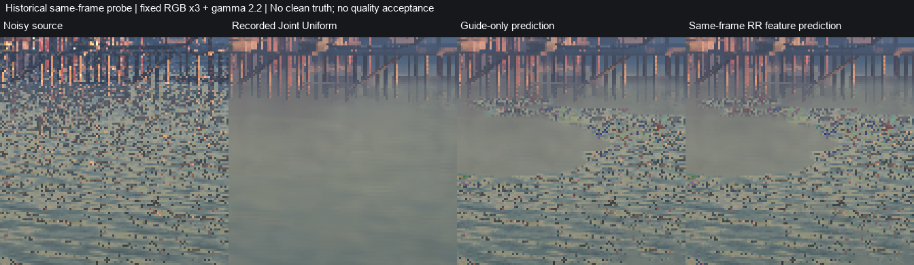
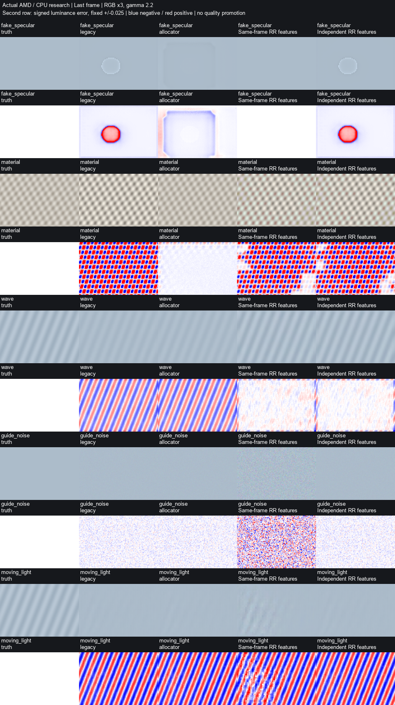
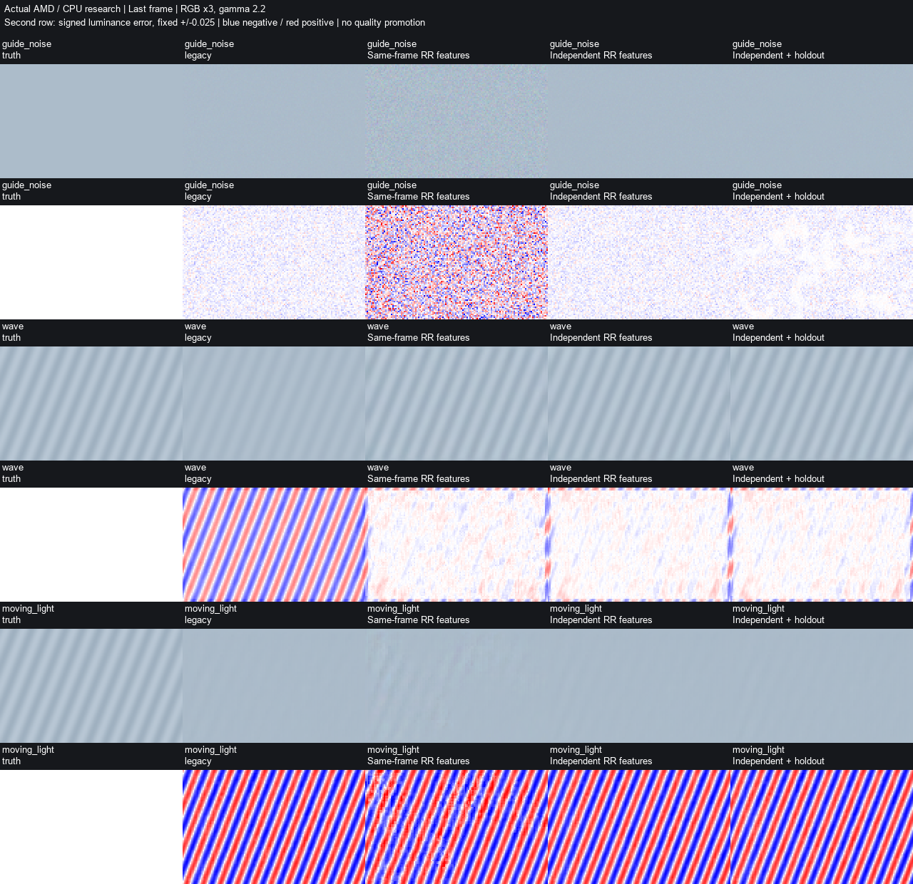
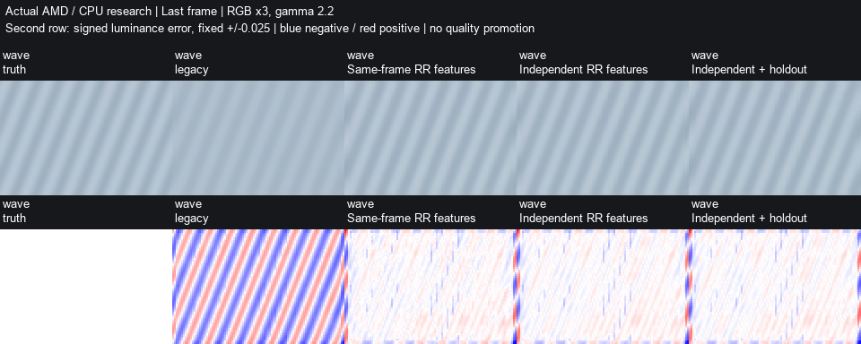

# Post-RR statistical resolve research

This follows the supplied review of `5febc967`. Reconstruction remains a CPU
experiment, not a game option. Production shader bytecode is unchanged. There
is no statistical resolve HLSL implementation or automatic quality promotion.

## Supplied evidence reproduced

Archive SHA256:
`089f92d9bd7bbda916218e383aa1bffef3656b196c7b99b56ae2cd5813e46b59`.
All 34 listed files authenticate. The package's 35 CPU tests pass locally.
Its three probes reproduce all 60 conditions with differences below `5e-16`.
Four authenticated historical captures reproduce 3,375 RGB fits: maximum
prediction-RMSE difference `5.81e-15`, coefficient difference below `1.8e-12`,
and unchanged ranks and decisions. Rank-deficient third-basis condition numbers
near machine singularity differ across Linux/Windows SVD implementations. They
are not meaningful finite condition estimates or byte-exact reproduction.

This reproduces predictions of noisy observations, not clean game quality.
The proportional-guide allocation counterexample and moving-light failure of
the Gaussian proxy remain valid. Neither establishes every game's root cause.

## Applied-model validation fixed

The CPU allocator validated unconstrained coefficients, then clipped them before
use. The seed-44 case has held-out error `0.0438636` before clipping, `0.0692650`
afterward, against a `0.0622353` gate. This is a research-tool defect, not evidence
that this code caused the game blotch.

`fsrd_small_regression.py` enumerates and refits the small NNLS problem's active
faces. The allocator validates exactly those applied coefficients and recomputes
training/held-out errors and covariance. The incompatible-negative-physical-model
guard remains. The evaluated positive third term also uses NNLS, without a route
into specular. Unconstrained coefficients remain separate diagnostics.

Boundary coefficients retain full-design covariance from the constrained
residual: zero is not treated as certainty. This conservative local approximation
is not a calibrated constrained confidence interval. The solver agrees with
SciPy over 1,000 random objectives to `1.07e-14`; another 1,000 designs check KKT
conditions without requiring SciPy. Seed-44 verifies applied-model validation.

## Paired capture v2

**Input Compatibility > Additive channel capture** now records
`fsrd-additive-live-v2`: the existing 96 FP32 journal images plus an exact FP16
ROI copy, `pre_sr_output.f16`, from the configured composition before SR. This
includes Floor/detail recovery. It is neither bare neural output nor an AMD
strength-0/1 A/B; only the diagnostic input journal has both endpoints.

Metadata includes RR frame index, reset/dispatch flags, view/projection, jitter,
motion scale, camera delta, depth bounds, composition flags/controls, and NGX
pre-exposure with a provided/default indicator. RR has no pre-exposure dispatch
field; this value is explicitly NGX/SR metadata. The recorded production shader
hash identifies the selected conversion PSO.

Pairing requires the same command list, render extent, and successful normal
composition. The next conversion invalidates an unpaired request. Debug, failed,
skipped, mismatched or discarded evaluations cannot publish a pair. The existing
actual queue-fence plus command-list Reset contract owns all resources. The copy
restores source state and does not modify color, signals, guides or alpha.

The reader supports v1/v2 and authenticates all image/constant hashes and sizes.
It checks paired controls and exports the signed `raw - pre_sr_output` observation,
explicitly not a clean-reference error, in `channels.npz`.

```powershell
python OptiScaler/shaders/shader_tools/tests/inspect_fsrd_additive_capture.py `
  --capture <RRTrace/additive_directory> --output <fresh_analysis_directory>
```

A native WARP/debug-layer test uses the production copy helper with a nonzero
ROI, padded rows and exact FP16 bits. A second full copy verifies unchanged
source bytes and restored state. Fence/Reset gate readback. These tests do not
certify injected hooks in a game; a fresh v2 game capture is still required.
Partial-width read ranges end after the last used texel, not after hypothetical
padding beyond the allocation's last row; this also fixes the v1 journal copy.

## Statistical reconstruction

`fsrd_statistical_resolve.py` fits signed affine coefficients to net RGB using
diffuse/specular guides and optionally composed RR color. It applies
`baseline + confidence * (prediction - baseline)`, confidence in `[0,1]`.
Signed unexplained `raw - prediction` is recorded, never erased or raw-Skip routed.
Coefficients never enter AMD inputs, guides or alpha.
Fit and feature uncertainty are local approximations. Feature propagation uses
per-feature variances and does not include cross-feature covariance; it is not a
calibrated confidence bound or sufficient evidence for runtime acceptance.

A connected geometry-limited ring surrounds an excluded 8x8 center. Separate
ring tiles train/validate; the center is also scored. Depth planes, normal and
roughness boundaries limit borrowing. Rank reduction describes a statistical
span, not identified lobes. Outside-span prediction, condition, leverage,
prediction uncertainty, net-radiance validity and held-out error have explicit
guards. Net predictions are not clipped after validation. Overlap confidence
can still imprint coverage; bounded blending alone is not a halo guarantee.

The guarded variant requires four distinct experimental streams, nonduplicated
observations and at least three effective observations. Correlation of raw
temporal increments reduces the count. Shared lighting/motion can reduce it;
shared static bias can escape this estimator, so provenance remains required.
Raw inter-stream correlation is separately reported and includes scene signal.

Four independent noisy sequences have separate AMD contexts and disjoint random
histories. These are privileged experimental replicates, not consecutive game
RR outputs. Only preceding observations are used. Reset, early history, invalid
correspondence, dimension mismatch, lighting change and feature uncertainty
trigger fallback. Fallback retains baseline defects and is not quality success.
No game motion estimator or GPU temporal history allocation is implemented.
The disocclusion control supplies its validity mask; this does not validate an
automatic correspondence estimator for water or reflections.

Guide-only and same-frame RR-feature variants are comparison probes explicitly
ineligible for promotion: their held-out score can reward shared source noise.
Clean metric truth is never supplied to reconstruction.

A further counterexample exposed **validation-source coupling**: a baseline that
copies its current noisy input has zero error against that input, so an otherwise
good independent denoised predictor loses the comparison. Spatially held-out
pixels do not make a baseline independent of its own source image. The regression
test reproduces this and shows that a separate noisy validation observation can
restore the correct preference without supplying clean truth to the estimator.

Later studies therefore add `independent_validated_rr`: three independent contexts
supply feature means, while the fourth stream's preceding aligned raw observation
is reserved for validation. The current raw observation trains the coefficients;
the validation stream never enters the feature mean or fitted response. The same
temporal/correspondence gates apply. Original six-way studies remain separately
identified by their immutable source snapshots; this seventh comparison is an
explicit follow-up rather than a rewrite of their outcomes.

## Historical Joint output sanity check

`probe_fsrd_recorded_resolve.py` authenticates six payloads from each of the four
old captures, including their recorded `composition_production`. This is a
same-frame predictive check of historical JointFieldV1 output, not an alpha
Legacy replay. The ROI is `[5,25,85,85]`, with surrounding geometry support.

On the original Uniform capture, guide-only observation RMSE changes from
`[0.03626, 0.03011, 0.02042]` to `[0.02931, 0.02235, 0.01564]`, with 52–55% RGB
activity. That is not clean-reference improvement. Visual inspection shows
strong speckled structure returning while a smooth island remains. Selective
correction can make that contrast more conspicuous. This confirms the need to
reject shared-source noise and inspect coverage, even when observation error
decreases. It does not identify which game input physically caused the spot.



## Real AMD protocol

`probe_fsrd_statistical_resolve.py` compares Legacy, current additive, corrected
two-lobe overlap allocation, guide-only, same-frame RR-feature, and guarded
independent-observation RR-feature reconstruction. Actual AMD dispatches use
production packing/composition with Floor disabled to expose modulation.
The fixtures use a planar surface, a static camera, uniform roughness `0.55`
and the default miss-distance signals. An island produced here does not require
a roughness pattern, but this does not rule out roughness as a contributor in
the game. These fixtures do not reproduce layered water/reflection geometry.
CPU source features have exactly the RGBA16_FLOAT values uploaded to conversion.
A preliminary run accidentally exposed pre-storage guide precision to the CPU
predictor; it was marked superseded and excluded from acceptance evidence. The
typed rerun and source round-trip regression are authoritative.

Three null contexts per scene have identical seven input payloads, camera,
jitter, reset sequence, flags, tuning, DLL and executable. The native runner
records pointer-free applied controls every frame; manifests hash these bytes
and all input/output payloads. Metadata-only pre-exposure changes leave raw
radiance untouched, distinct from the actual lighting-step fixture.

Scenes include false diffuse/specular/combined islands, actual material texture,
independent waves, correlated guide noise, stale surface motion under moving
light, lighting steps, HDR, resets and declared disocclusion. A second resolution
and seed use separate contexts. CPU tests verify resolution-change invalidation;
these are not an in-context AMD DRS validation.

Fixed gates cover signed RGB bias, broad tone, ring width, temporal residual,
detail amplitude/phase, and every early/transition frame. Active improvement must
exceed both 5% RMSE and three times observed null RMS. Three repeats give an
empirical spread, not a calibrated population confidence interval. No-op
nonregression is not success.
The full-sequence temporal error statistic includes startup convergence as well
as noise. Supplemental final-window statistics and a 64-frame wave/lighting-step
study distinguish persistent variation from the first two fallback frames;
early-frame errors remain separate gates.
Output-change activity for additive/allocator versus Legacy can include arithmetic
differences between conversion PSOs. It is not proof of physical allocation
transfer; the existing same-DXIL strength-0/1 journal remains the transfer test.
These image comparisons do not replace that channel-level evidence.

Visual inspection exposed a gap in the original radial-width gate: it stopped
at normalized radius 2. A faint support-shaped box farther out could pass even
when it was obvious in the fixed-scale error view. The additional
`fsrd_quality_contours.py` diagnostic covers the full ROI, removes only a common
far-exterior RGB offset (uniform bias is scored separately), and measures
significant error at the original `0.002` threshold over the final four frames.
It records affected pixels beyond radius 1.5 and the 95th-percentile radius.

For the typed 96x64 diffuse control, the allocator leaves 231 significant pixels
outside that region versus zero for Legacy; radius95 expands from 1.23 to 3.51.
For the specular control those counts are 1,101 versus one; radius95 is 3.58 versus
1.30. The broad box fails this additional gate despite lower RMSE. This is an
explicit conservative **post-inspection** addition, not a claim that the criterion
was preregistered. Original scores are retained alongside the extended decision;
the new check only removes successes and never rescues a failed candidate.

```powershell
python OptiScaler/shaders/shader_tools/tests/probe_fsrd_statistical_resolve.py `
  --output tools_tmp/resolve_study --size 96x64 --frames 16 --seed 290929

python OptiScaler/shaders/shader_tools/tests/probe_fsrd_statistical_resolve.py `
  --output tools_tmp/resolve_mature --size 96x64 --frames 64 --seed 290929 `
  --scenes wave,lighting_step

python OptiScaler/shaders/shader_tools/tests/summarize_fsrd_statistical_resolve.py `
  --studies tools_tmp/resolve_study tools_tmp/resolve_mature `
  --output tools_tmp/resolve_summary.json
```

The current driver runs seven comparisons. The original primary study's six-way
snapshot remains identified separately; later source changes are not presented
as the code that produced its evidence. Full sequences and per-frame diagnostic
arrays remain in the local study directories; the repository carries compact
authenticated summaries and fixed-scale figures.

The evidence records measured outcomes. A runtime port still requires accepted
moving-scene quality, fresh paired game data, in-context DRS/exposure mapping,
and target-GPU lifetime/performance measurements. Numerical tests alone do not
justify a new production HLSL path.

## Measured outcomes

The 16-frame primary study uses 96x64, seed 290929 and the original six models.
The follow-up uses 128x80, seed 91743 and seven models on false specular islands,
material texture, waves, guide noise and moving light. Each study preserves its
actual source snapshot. There is no accepted general blotch correction.
Together with the 64-frame follow-up, this is **127 model comparisons across
180 native contexts and 3,744 actual AMD dispatches**, all with zero reported
SDK/D3D12 errors or warnings and the debug layer enabled. These are experiment
counts, not 127 successful quality checks.

The two 16-frame studies have bit-identical null outputs. The 64-frame wave
study has one nonidentical null repeat despite matching inputs, controls and
binaries: RMS `0.0000989`, maximum `0.0010986`. Its observed spread is included
in the improvement gate; the other mature null repeats are identical. Therefore
the evidence does not assert that the AMD model is universally deterministic.

- Allocation is useful for the intended material class: primary material RMSE
  falls from `0.022693` to `0.003933` with current additive and `0.001025` with the
  corrected allocator. These controls pass their measured gates. False islands
  are a different result: specular RMSE falls from `0.008669` to `0.002774`, but
  signed RGB bias and the full-ROI contour fail. The diffuse island also leaves
  a broad box. Lower RMSE does not establish a successful blotch fix.
- Same-frame guide/RR predictors copy correlated noise. Primary guide-noise RMSE
  rises from `0.002775` to about `0.011994`, over four times worse. The historical
  Uniform view independently exposes the same observation-error trap, without
  providing a clean game reference.
- Independent validation addresses one specific selection defect. At 128x80,
  guide-noise RMSE falls from `0.002768` to `0.002365` (14.6%), with 40.9% changed
  RGB samples and all measured gates passed. The older independent variant is
  inactive. This is one fixture/seed result, not a general acceptance or evidence
  that four independent observations are available in a game.
- Wave amplitude can return while temporal behavior worsens. In the primary
  study, the independent variant lowers RMSE from `0.010904` to `0.006181` and
  restores last-frame contrast gain from `0.4064` to `1.0036`. Its final-four-frame
  temporal error standard deviation is `0.000636`, versus Legacy `0.000145`.
  The seventh variant also fails the temporal gate at the second resolution.
  In the 64-frame follow-up, independent validation restores last-frame gain
  from `0.5304` to `1.0011`, but final-four-frame temporal error variation rises
  from `0.0000749` to `0.0006456` (8.6 times). Final-eight-frame variation rises
  from `0.0001080` to `0.0007519`. This failure persists after startup convergence;
  the sharper wave is not sufficient for acceptance.
- On moving light, both independent variants fall back completely at the second
  resolution. That avoids introducing stale corrections but leaves Legacy's
  loss of detail. It is explicitly not an effective success. On actual textured
  material, redundant/noisy features frequently fail conditioning; accepted
  subsets still fail the temporal statistic.
- The mature lighting-step test fails too. On the first changed-light frame,
  Legacy RMSE is `0.09126`, additive `0.10497`, and allocator `0.10509`.
  Independent variants reject that transition and retain Legacy's result.
  Over the complete sequence, their limited accepted corrections still worsen
  red-channel signed bias beyond the gate. Same-frame predictors score well on
  this particular material fixture but remain ineligible after their separate
  correlated-noise failure; a favorable fixture cannot rescue the full method.







## Validation and remaining work

The Release x64 build and full existing gate pass: **3,342 GPU checks across
4,679 dispatches** on RX 9070. All six embedded shader binaries rebuild
reproducibly; the five production binaries are unchanged. Five historical
comparison groups are unavailable and explicitly skipped, not counted as passes.
Follow-up checks pass 20 statistical CPU tests, 14 capture-reader tests and the
11 lifetime state checks plus native WARP copy/state/nonmutation smoke test.
The supplied package's 35 tests and numerical reproductions are separate from
these counts. No DLL was installed into the game.

The metadata-only exposure control has identical native input/control/output
manifests in all nine contexts, and identical saved color sequences, despite
changed exposure metadata. This verifies the control's isolation; it does not
validate the game's pre-exposure mapping.

The next research decision is to reduce feature redundancy while preserving an
independent validation target, then demonstrate stable active correction under
moving illumination. Full feature covariance and a justified effective sample
count remain necessary for reliable uncertainty. Fresh v2 captures must pair
the actual alpha output with its source; the old Joint captures cannot stand in
for that data. Correct reflection correspondence, in-context DRS and exposure
changes must pass before a runtime implementation. The current evidence does
not justify another strength slider, global roughness replacement or an HLSL
resolve option.

Validation and reproduction details: [machine-readable evidence](evidence/fsrd_alpha_resolve_validation.json).
Historical paired observation check: [evidence](evidence/fsrd_alpha_recorded_resolve.json).
All three authenticated AMD studies: [measurements and decisions](evidence/fsrd_alpha_statistical_resolve.json).
