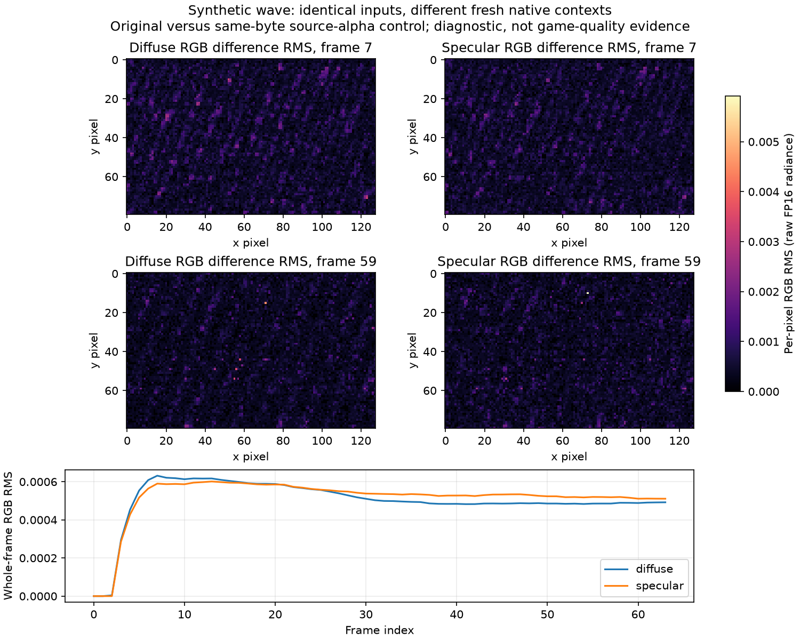

# FSRD source-mean innovation and correction-subspace follow-up — 2026-09-30

The stain/wave objective remains open. A source-only RGB mean innovation rule
improves the mature noise/detail tradeoff of the saved matching harmonic
responses, but weak material still worsens and full absolute detail remains
0/6. This package adds no native/GPU dispatches, game run or runtime changes.

## One frozen final-DC rule

The target constructor receives observed RGB, reset/jitter controls, optional
source-only epoch and exposure metadata. It never receives truth, scene labels,
baseline B, pilot P, or native response T(P). An interior5-pixel ROI supplies
the current perRGB spatial mean. A fixed proper-complex Fourier coefficient
median estimates nominal perRGB IID mean variance; no signal-selected noise
mask or confidence claim is used.

The current mean is compared with at most63 prior observed means using
`3*sqrt(q_current + sum(q_prior)/m^2)` in each channel. Any-channel innovation
selects the current mean and clears only the DC history. Otherwise the target
averages at most64 inclusive observed means. Reset, exact jitter/source-epoch
change, supplied exposure change and invalid input also cut history. Source
and DC epochs remain separate; there is no new pilot warmup or changed P.

A separate application shifts the existing `B + active*(P-T(P))` uniformly to
the target interior mean. Inactive/invalid-target frames keep exact baseline;
the reported safe variant uses the existing atomic wholeRGB invalid-pixel
fallback. Target closure and fallback activity remain recorded. All original
six plain/history/current-DC controls and failure rows remain unchanged.

The prototype, constants, scorer and all inputs were frozen before scores.
Producer checks cover target/state causality, reset/jitter/epoch/exposure,
large steps, source impulses, invalid/nearzero input, first8 inactive exactB
and uniform-shift algebra. Root's independent explicit complex DFT and direct
history-suffix implementation matches targets exactly, target variance within
2.55e-21 and Fourier coefficients within6e-18. These checks verify arithmetic,
not the IID model or effective sample count.

## Saved-response and source results

All six saved native scenes use their actual matching P/T(P), with no alternate
pilot or old wrong-P response substitution. Original control metrics across
all four windows reproduce bit-exactly in an independent recalculation.

Safe mature actual mean-pixel residual temporal STD ratios to native baseline
are material0.72135, wave0.96025, moving light0.02807, weak material1.11054,
lighting step0.18411 and reset0.48310. Strict actual STD improves5/6, versus3/6
for current-mean restoration. Mature absolute detail passes5/6, and the tolerant
relative gate passes6/6. Full relative effective passes3/6, strict STD passes
3/6 and absolute detail passes0/6. No gates or parameters are relaxed.

The quiet branch retains the history64 benefit. Lighting step can clear old
illumination immediately, instead of retaining the old mean as its previous
history-only control did. This is an observed mean-change response, not an
identification of physical illumination or source noise.

All13 authenticated source families and22 adversaries are separately scored
as CPU source-domain proxies. The13 mature proxies pass strict STD/absolute
detail, with11 effective improvements, but full effective remains0/13 and
weak full absolute detail fails. Adversary absolute detail passes12/22 full
and18/22 mature. These proxies do not fill the missing native responses for
the other source families/adversaries or establish game quality.

Fixed-model supplementary controls show a slow true DC drift lag of−0.000270485
without innovation, and a spatially shared RGB artifact triggering79/79 cuts
with exact current-mean targets. Artifact and lighting can be observationally
identical. Texture-contaminated plug-in variance, RGB/spatial/time correlation,
source impulses, slow drift and changing coverage remain explicit limitations.

## Remaining weak-detail fluctuation

A read-only identity projects the actual saved correction onto the continuous
physical atom frequencies recorded by the source-only pilot. The interior
complex-exponential basis is centered and rank-checked by SVD. Correction is
exactly DC plus source-fitted atom projection plus orthogonal remainder;
temporal covariance and changing-basis effects are retained. This is not a
new projected candidate or a causal noise-removal percentage.

For mature weak material, baseline nonDC error variance is4.880723e-9; atom
correction variance is1.571463e-9, orthogonal correction0.292091e-9. Their
baseline cross covariances are−8.712118e-12 and−2.580477e-11. The exact resulting
nonDC error variance is6.675243e-9. Dropping only the orthogonal remainder
would leave the larger atom fluctuation. Reference enters this scored-error
decomposition only, never the basis or correction fit. Deterministic appearance
error and native context variation remain mixed with stochastic noise.

## Independent native-alpha audit and provenance

The separate independent audit authenticates all11 previously completed alpha/
identical-repeat contexts and704 RR dispatches, all seven payloads, formats/
upload counts, applied184-byte controls, raw lobes, guard and ordinary debug
logs. Material remains exact. Wave's28 pairs contain15 identical-input pairs,
9 nonexact, with maximum lobe RGB RMS0.000529977. The same-input source-alpha
context diverges at frames2–63; smaller repeat differences start at35–39.
Output alpha stays exact zero. There is no alpha-effect or root-cause claim.
Preparation assertions/import errors are preserved, without invented logs.

The following retained-lobe plot shows the same-byte wave control at the
already audited difference maxima, frames7 and59, and its complete temporal
RGB RMS. It is a synthetic native-context diagnostic, not a game stain image.

[The compact archive](evidence/fsrd_dc_innovation_followup/manifest.json)
retains39 files including designs, frozen model/scorer, reports, checks, source
pins, independent audit and descriptive covariance scripts. Earlier actual
payloads remain retained and pinned in the preceding harmonic archive. No
native context is counted again: completed totals remain370/19,312 RR calls.
The next design must address coefficient fluctuation while preserving real
weak/moving/dense detail; the first8 baseline and full-sequence failures remain
required checks. No current-alpha game capture is available.
