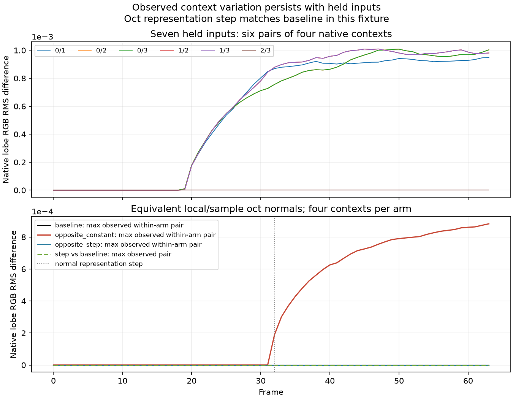

# FSRD held-input and normal follow-up — 2026-09-30

The stain/wave goal remains open. This package adds eight conversion jobs and
sixteen native contexts / 1,024 completed RR dispatches. The independently
audited camera tests pass; held-input native outputs can still differ between
fresh contexts. The tested oct corner step did not produce a difference from
baseline. These diagnostics narrow hypotheses and accept no image-quality fix.
Production shaders, settings and the installed alpha game DLL remain unchanged.

## Current and previous camera conformance

The current camera translates to `[.3,.1,-.2]` and rotates Y by `.17` radians;
the previous camera is `[.29,.1,-.2]` and `.15`. Independent rays intersect a
fixed world plane at Z=10. Matrices are consumed as float32 first. Four arms
combine linear/hardware depth and world/view-space normals, each at split0/1.
Hardware depth exercises the defensive direct-input branch, rather than proving
the production FloorSeed canonical-depth pipeline for arbitrary games.

All eight jobs pass the preregistered all-pixel motion and hit-alpha tolerances.
Maximum physical MVZ error is `0.00011667525`, within maximum neighboring FP16
ulp plus `1e-5`; primary motion XY matches actual uploaded FP16 exactly. Decoded
world-normal angular error is zero in these four quantized arms. Specular alpha
matches reconstructed current depth; diffuse alpha is exactly65504. Split0/1
changes only the expected constant-buffer strength bytes and all eight stored
output textures match exactly for these constant-radiance fixtures.

The second agent authenticates actual416-byte CBs, all17 uploaded inputs, all8
stored outputs, actual CSO selection, per-job zero-error/warning logs and saved
NPZ arrays. This is conversion conformance, with zero native RR calls. It does
not establish arbitrary camera/normal handling or game image quality.

## SDK normal example discrepancy

The local and SDK sample oct encoding/decoding algebra agree and use the same
R10G10B10A2_UNORM representation. All four exact oct corners decode to `-Z`.
The packaged documentation's example encoder/decoder is internally inconsistent
for this boundary: its exact `-Z` encoder gives center UV, which its decoder
maps to `+Z`; its corner decode also differs from sample/local code. The saved
CPU/source review demonstrates the discrepancy without changing the SDK or
asserting that the private provider uses the documentation example.

## Held-input context repeat

Four contexts of the same pinned native binary/provider consume exact first-frame
bytes of all seven earlier native inputs. Radiance, guides, geometry and noise
field are held for all64 frames. Tuning1 retains the existing six fork values;
all184-byte applied controls match the prior source controls exactly. Inputs
with frame count1 upload once, so this changes both temporal data and later
upload command behavior from the variable-input study. It is not an isolated
test of a caller barrier or provider cause.

Five of six repeat pairs differ, with full RGB RMS `0.00069554–0.00073034`; one
pair is exact. First nonzero difference is frame19. Alpha remains identical.
Changing temporal input values is therefore unnecessary for context variation
in this held-input fixture. Four repeats do not give a population bound or
identify whether the hidden cause is in the caller, driver or provider.

## Equivalent normal representation study

A new blocked study runs four fresh contexts in each of three arms: baseline
corner `(0,0)`, constant opposite corner `(1,1)`, and `(0,0)` through frame31
followed by `(1,1)`. R10 roughness/material bits and all six other inputs remain
exact. Both normal codes decode to physical `-Z` in the local/sample algebra.
All camera/jitter/reset controls remain equal, with no reset at the normal step.
The step arm uploads its normal texture every frame, while the constant arms
upload once; upload scheduling therefore also differs in this comparison.

All four baseline outputs and all four step outputs are byte-identical to each
other for every frame. Three constant-opposite outputs also match; one differs,
giving RGB RMS `0.00050758` (post32 `0.00071782`). Its first differing frame is32,
although this arm's normal never changes. The step hypothesis is unsupported here; the
constant-arm outlier alone does not establish a normal encoding cause. The
earlier held-input variation remains evidence even though this later baseline
block is exact. General normal-field/native invariance is unproved.

## Resource monitoring and evidence

Ordinary native SDK/D3D12 logs report zero errors and warnings for all16
completed contexts. GPU-based validation remains untested by these runs. A
lightweight owned-child monitor samples available memory/working set every.2s,
with240s timeout,2GiB child limit and1GiB free-memory floor. Observed native
working sets are about84–91MB in the held-input block. These are sampled limits,
not hard OS reservations; overshoot between samples remains possible. Harmless
child checks exercised successful execution, working-set termination, timeout
termination and refusal to launch below the free-memory floor.

The immutable compact archive records scripts, preregistrations, reports,
independent audits, actual shader jobs, geometry fixtures, controls and generated
normal bytes. Full raw native outputs and executables remain on their original
paths with exact SHA-256 identities in the manifest. Earlier archives are
preserved. Completed native totals become305 contexts /15,152 RR dispatches,
including the earlier64-dispatch Python-metadata-failed native completion.
Separate provider-default queries and incomplete instrumented validation are
not counted as completed RR contexts in that total.
