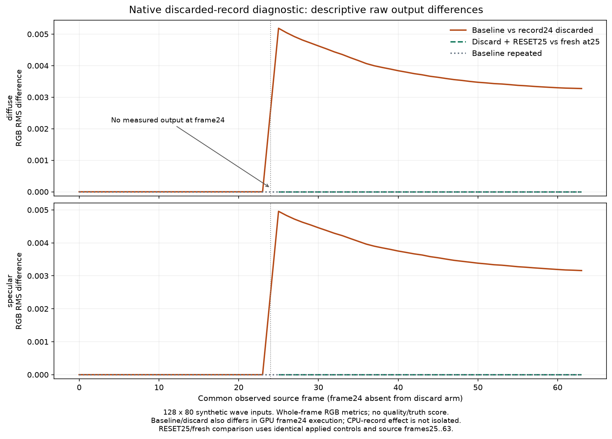

# Native discarded-record diagnostic — 2026-09-30

The stain/wave objective remains open. Eight guarded native contexts measure
what happens when a successful SDK recording is discarded before queue
submission. The test adds462 successful API RR recordings,458 queued RR
dispatches and four recorded-only discards. Those units are separate: the
four discards have no GPU output. All eight contexts complete with zero
ordinary D3D12 validation errors/warnings and zero SDK errors/warnings.
No production source, shader, configuration or game DLL changes are made.

The isolated runner is copied from the pinned standalone RR runner. The
seven synthetic wave inputs, signal types, formats and SDK settings are
unchanged. Each submitted frame executes and completes its fence before the
next recording. The test covers four conditions twice, with reverse order
in the second round: baseline64 frames, record-but-discard frame24,
discard24 then RESET25, and a fresh context beginning at sourceframe25.
Fresh-tail input bytes are actual slices25..63; the SDK receives those same
frame indices, not0..38. Its39 applied184-byte controls exactly match the
recovery arm's tail, including RESET at25 and NON_GAMMA_ALBEDO thereafter.

The discarded recording really calls api.Dispatch successfully. It then
closes its command list and restores the shadow states of nine external
resources, without executing, signaling, waiting or copying/readback for
that frame. Frame23 has already completed. Frame24 appears in the successful
recorded indices and has a zero presence byte, but is absent from observed
indices and raw output arrays. Each discard arm stores63 measured outputs;
no zero-filled frame24 is treated as an observation. SDK-private CPU state
is not rolled back. The public headers do not establish an SDK contract for
discard rollback, so this is a conditional experiment rather than an SDK
bug or supported-usage claim.

All four within-condition round repeats are RGB/RGBA bit-exact for both
lobes. Baseline versus discard is exact on common sourceframes0..23; RGB
first differs at25 and remains different through63. Across all63 common
frames, diffuse RGB RMS difference is0.003068512392630358 and specular is
0.002974842970905593. These are raw output differences, not noise reduction,
image-quality improvement or error against truth. Every recovery/fresh-tail
cross-round pairing is RGB/RGBA bit-exact on all39 common frames25..63.
That establishes a measured RESET recovery property for this cohort only.

The frozen CPU analyzer compares all28 context pairs, both submitted-ordinal
and common-source-frame alignments, and both lobes. Each compared frame
retains its source IDs, applied flags and184-byte control identity. Ordinal
alignment can pair different sourceframes after a missing frame and is not
a same-frame causal comparison. Baseline/discard also differs in whether
GPU frame24 ran: this batch does not isolate the effect of CPU api.Dispatch24
from the effect of missing GPU history. A separate no-API frame24 control
is being prepared; it is not part of these eight measured contexts.

Preparation preserves three accounting versions. V1 aggregated native work
after metadata acceptance; V2 separated work from acceptance but could let
conflicting artifact claims override the footer. Both were corrected before
native launch, with all old versions and simulated CPU checks retained. V3
uses the valid bounded final C++ footer as authoritative under pinned
source, retains conflicting artifact claims separately, and reports qualified
lower bounds and unknown totals if a reliable footer is absent. Planned
capacity never fills missing measurements. The independent ready review and
producer final-seal review preceded root authorization and native execution.
The actual output audit follows execution. A post-run summary preparation
also caught a mistaken pairing of the ready-manifest hash with an earlier
manifest filename; that CPU attempt and correction are preserved separately.
The root launch authorization's ready and final-seal pins were correct.

The [compact archive](evidence/fsrd_native_discarded_recording_diagnostic/manifest.json)
retains preparation versions, registered inputs/controls, accounting checks,
root authorization, prelaunch review, actual logs and metadata, all-pair
comparisons and the independent post-native audit. Large raw buffers and
executable payloads remain at their pinned F-drive paths with SHA256/size
references. The descriptive figure was created after execution and analysis.

Completed native totals become390 contexts/20,542 successful API RR
recordings, of which20,538 were queued and four were recorded-only discards.
The earlier40 identity-fixture shader dispatches are not native RR calls.
There is still no current-alpha game capture. These results do not establish
that the title discards evaluations, that this is the visible stain's cause,
or that a runtime remedy has been accepted. The
[recording-lifetime follow-up](fsrd_recording_lifetime_followup.md) separately
covers conditional CB/descriptor reuse and the source failure-path policy.
