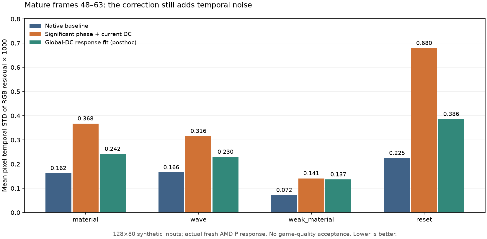

# FSRD specular-alpha and phase-response follow-up — 2026-09-30

The stain/wave objective remains open. Thirty new native contexts completed
1,920 RR dispatches. A phase-aware source pilot and a nonlocal response-fit
hypothesis both fail the required combined image-quality checks. Positive
specular hit alpha does not eliminate held-input context variation. No
production shader, setting or installed game DLL changes follow from these
diagnostics. Work remains on `ffxD-experimental-alpha` in the F-drive clone.

## Specular hit-distance alpha

The packaged API describes indirect specular input alpha as ray distance and
documents preserved output alpha. Its active-pixel rule distinguishes negative
values, without establishing that zero is invalid. SDK sample sky/miss input
uses65504; actual secondary geometry uses an actual ray distance. The local
roughness tracking factor reaches zero at roughness.55, so the synthetic
converter fixture supplies specular alpha0. This is a custom virtual-hit
handover, not proof of an API violation.

A blocked native experiment compares alpha0,10 and65504, four contexts each,
64 frames. Only bytes6/7 of the indirect-specular RGBA16_FLOAT input change;
all RGB, six other inputs, upload counts,184-byte applied controls and tuning
remain identical. Alpha10 is a counterfactual distance, not a proposed fix.

All zero and65504 outputs match exactly. One alpha10 context differs from the
other three and baseline: RGB RMS `0.00102650`, first difference frame4. Thus
zero alpha is unnecessary for context variation in this fixture. The result
does not identify a caller, driver or provider cause or a population bound.
Every output alpha is zero, including positive input-alpha arms. This saved
observation differs from the public preservation wording; composition ignores
these output alpha values, and its cause is unresolved. The second agent
checks all12 contexts/768 dispatches,50 raw comparisons, inputs and controls.

## Phase-aware pilot and uncertainty limits

The first source-only prototype aligns past spatial Fourier coefficients using
a past-only pooled RGB phase estimate before averaging. It keeps current DC,
history64, reset/jitter epochs and representability fallback. It is evaluated
against13 frozen source families and seven adversaries without native T(P).
It amplifies stationary noise: material mature STD rises24.55% versus the
previous hard-history pilot, wave21.96%. Small spurious phase estimates become
large alignment errors at old sample ages. Weak detail and acceleration also
fail; these source scores alone do not measure a native candidate.

An independent math diagnostic verifies the lag-phase imaginary variance under
independent proper complex Gaussian RGB noise. The linear term telescopes to
the two endpoint samples, plus an adjacent-noise quadratic term. Forty-eight
Monte Carlo cases,16,384 trials each, meet the predeclared6% engineering
tolerance; a second seed independently verifies12 cases with8,192 trials.
The exact aligned-mean derivative also matches finite differences. Plug-in
phase standard errors and first-order propagated bounds remain nominal,
without a confidence guarantee for selection or correlated real inputs.

The correlated-RGB counterexample has2.206 times the IID variance; temporal
AR noise also violates the IID formula. A separate proper-complex quadratic
form with known full covariance matches all50 saved Monte Carlo cases. This
uses oracle simulated covariance, not an available pilot estimate. The phase
of expected lag can also be biased under colored noise; no native conclusion
is inferred from the idealized model.

The second pilot sets phase exactly zero when its magnitude is at most three
nominal standard errors and propagates used-phase uncertainty into coefficient
thresholds. Its13 source families/eight adversaries improve upon the first
prototype, while retaining weak startup detail, acceleration and shared-bias
failures. Source code, preregistrations and both failed prototypes are preserved.

## Fresh native response to the second pilot

An initial mandatory matrix covers material, wave, moving light, weak material,
lighting step and reset, seed950301,128×80,64 frames. Each scene has fresh
source, null-repeat and pilot contexts:18 contexts/1,152 RR dispatches. The
new P is paired with its newly measured T(P); neither old T(P) nor an oracle
response is substituted. All consumed native guide RGB, geometry, hit alpha,
reset/jitter controls and six fork tuning overrides stay matched.

The pinned provider SHA is
`48f1e5888ba6a0a3d59a98b9751e37c392b0f7b8c223d0082d5c1f40642879d3`;
runner B SHA is
`3427689a4764380f885545c353250277e4d71944d3310c8a17b3cbba0f3c21d2`.
Ordinary SDK/D3D12 errors and warnings are zero for all completed contexts.
The reused owned-child resource monitor remains active; this is not GPU-based
validation or proof of hidden provider determinism.

For the separately declared current-DC plus representability-fallback variant,
only moving light and lighting step pass effective full and mature relative
gates together. Material mature STD changes `0.00016238→0.00036755` (+126.4%),
wave `0.00016566→0.00031601` (+90.7%), reset `0.00022484→0.00067951` (+202.2%).
Weak material full contrast ranges.6964–1.1566; mature minimum gain.9278 also
violates the absolute[.95,1.05] requirement despite its relative gate passing.
All phase gates pass, but detail and noise failures reject the general candidate.

The independent audit authenticates all seven raw native inputs, output lobes,
184-byte controls, logs and monitor results, regenerates source/P/reference
and recomputes all six variants and gates. It explicitly records a provenance
limit: actual converter/composition CB and packed shader payloads were cleaned
by the existing GPU helper. Job descriptions and source/native invariants are
retained, but a byte-level replay of those consumed shader payloads cannot be
claimed. All full sequences and native raw lobes remain externally hash pinned.
The1920 shader jobs separately comprise768 conversions and1152 compositions.

## Observable correction decomposition and global-DC hypothesis

Exact temporal variance identities on the six frozen native sequences separate
P, T(P), correction D and baseline residual. Material/wave/reset correction
variation is mostly non-DC: DC fractions8.39%,13.40% and6.80%. Its non-DC P/T(P)
correlations are only.030,.074 and.029 in the mature window. These are observable
associations, not proof of independent noise or a causal transfer model.
Material non-DC temporal RMS is `0.00033375` in P and `0.00004890` in T(P);
wave is `0.00024583` versus `0.00008269`. The pilot itself therefore varies far
more than its measured response in these stationary-truth fixtures. Repeating
contexts alone must not be assumed to remove that shared input variation.
The diagnostic uses clean reference only to decompose residuals and report
scores; sqrt(mean variance) is kept distinct from mean(pixel STD).

A new posthoc model predicts each D Fourier coefficient from both its own
current P coefficient and global pilot luminance DC, using current-inclusive
history16/minimum8 and the unchanged4× nominal-noise ridge. The prior
same-frequency model is a control. Source truth and guides never enter the
fit. This tests nonlocal guide artifacts driven by illumination, rather than
changing P while reusing its old native response.

Both models fail. The global-DC variant's actual mature STD remains1.490×
baseline on material,1.387× on wave,1.899× on weak material and1.718× on reset.
Lighting-step contrast still fails. Passing a relative STD gate with its
absolute allowance is explicitly not described as noise reduction.
Absolute full-frame gates expose additional failures: wave gain reaches1.1034,
and moving-light gain/phase fail during early frames. Those losses remain
failures even when relative aggregate gates pass.
Preparation selfcheck corrections are preserved before the first scene score:
expected RGB broadcasting and cancellation at collinear DC features. Numerical
rank deficiency now falls back exactly to the original one-feature model;
history, ridge and quality gates are not tuned after results.

The independent review retains a further counterexample: a single global-DC
impulse can coincide with unrelated native-response noise. A current-inclusive
DC fit can preserve that noise as if it were illumination response. Additional
features alone therefore do not establish reliable causal identification.
The actual reviewed model preserves99.966% of the constructed current impulse,
versus6.25% for the original same-frequency mean. A separate moving detail mode
can simultaneously retain almost unit gain/phase; that success cannot diagnose
whether the nonlocal impulse is signal or noise. The independent augmented
complex ridge solve agrees to `6.94e-18`, all six variants are regenerated, and
the exact temporal variance diagnostic is independently checked.

## Evidence and remaining work

The separate immutable archive contains both CPU candidates, mathematical
checks, preregistrations, preparation errata, native reports/controls/logs,
independent audits, posthoc diagnostic and plotted source identities. Large
full arrays/native binaries remain at original paths with byte hashes in the
manifest. Earlier archives are preserved. Completed totals become335 native
contexts/17,072 RR dispatches, including the earlier64-dispatch native completion
whose Python metadata step failed. Provider queries and unfinished instrumented
validation are excluded from these totals.

The prior registered100-check CPU suite is unchanged and is not repeated as
new image-quality evidence. The installed alpha DLL SHA remains
`FCB28C51556A905EABEC0125D1F078708645EF8F37511ACB939BB2FF51239240`.
No game run or new alpha channel capture is available. Historical Joint traces
remain useful for source geometry, but do not verify the current alpha backend.
Next work must distinguish input-dependent correction noise from hidden
context variation and preserve weak/dynamic detail before any runtime change.
